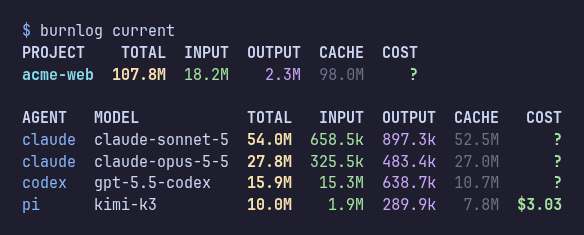
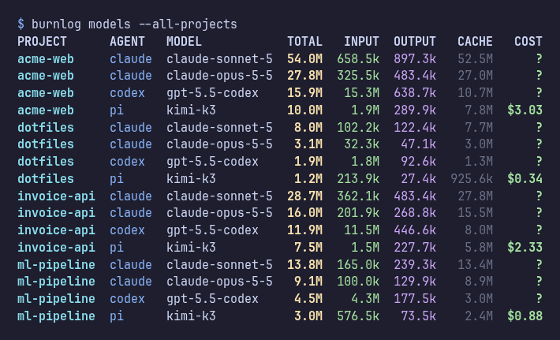

# Herdr BurnLog

BurnLog keeps local, project-based token and recorded-cost history for Herdr-managed agents. It is a dependency-free Python/SQLite collector with CLI reports and Herdr popup panes.

## Requirements and compatibility

- Python 3.10 or newer (standard library only)
- Git, for repository identity
- Herdr 0.9.1 or newer for plugin integration
- Linux or macOS

CI is configured for Python 3.10 and 3.14 on Ubuntu, plus Python 3.14 on macOS. The current local release check used Python 3.14.7, Herdr 0.9.1, and Linux x86_64. See [GitHub Actions](https://github.com/naturalmoods/herdr-burnlog/actions) for current CI results.

Verified source formats are Codex CLI 0.153.4–0.157.1, Claude Code 2.1.220–2.1.282, and Pi session format 3. OpenCode is not supported because no real local format sample was available.

## Install

Install from [naturalmoods/herdr-burnlog](https://github.com/naturalmoods/herdr-burnlog):

```sh
herdr plugin install naturalmoods/herdr-burnlog --yes
```

For local development, from this checkout:

```sh
herdr plugin link --enabled "$PWD"
```

Herdr installs are global to the current user and available in every Herdr session. `install` clones a GitHub repository into Herdr-managed plugin data; `link` registers this existing checkout and does not copy or build it.

Uninstall a published install by plugin ID or by its original GitHub source:

```sh
herdr plugin uninstall herdr-burnlog
# or: herdr plugin uninstall naturalmoods/herdr-burnlog
```

Unlink a development checkout without deleting it:

```sh
herdr plugin unlink herdr-burnlog
```

Herdr 0.9.1 preserves plugin config and state on both uninstall and unlink. A GitHub-managed uninstall removes only the managed source checkout. BurnLog history therefore survives reinstall; delete `burnlog.sqlite3` from BurnLog's Herdr plugin state directory separately only when you intend to erase the history.

## Use





```sh
./burnlog collect
./burnlog projects --all-time
./burnlog current --daily
./burnlog models --monthly
./burnlog project my-repository --all-time

herdr plugin pane open --plugin herdr-burnlog --entrypoint current --focus
herdr plugin pane open --plugin herdr-burnlog --entrypoint projects --focus
herdr plugin pane open --plugin herdr-burnlog --entrypoint models --focus
```

Popup reports stay open until you press Enter, including when an error is shown.

To open BurnLog with your Herdr prefix (`prefix+b`: current project with its models; `prefix+shift+b`: all projects), add to `~/.config/herdr/config.toml` and run `herdr server reload-config`:

```toml
[[keys.command]]
key = "prefix+b"
type = "plugin_action"
command = "herdr-burnlog.open"
description = "BurnLog current project"

[[keys.command]]
key = "prefix+shift+b"
type = "plugin_action"
command = "herdr-burnlog.open-all"
description = "BurnLog all projects"
```

`python3 burnlog.py` is equivalent to `./burnlog`. `--daily` is the current UTC day and `--monthly` the current UTC month; the default is `--all-time`. Inside Herdr, `projects` and `models` list only projects with an open pane; `--all-projects` lists every Git project (plain folders show only while open).

Direct CLI data is stored at `$XDG_STATE_HOME/herdr-burnlog/burnlog.sqlite3` (normally `~/.local/state/herdr-burnlog/burnlog.sqlite3`). Herdr supplies a separate plugin state directory when it launches BurnLog. To make direct commands use the linked plugin database on the tested Linux setup:

```sh
export HERDR_PLUGIN_STATE_DIR="${XDG_STATE_HOME:-$HOME/.local/state}/herdr/plugins/herdr-burnlog"
```

A `?` total means at least one contributing source record lacks that value. Token categories are reported separately; they are not added together because source semantics differ.

## Privacy and retention

BurnLog reads local Codex, Claude Code, and Pi JSONL session files. It stores session/evidence IDs, timestamps, agent/model names, token and source-recorded cost fields, source versions, repository identity evidence, and local checkout paths. It does **not** store prompts, responses, tool output, credentials, or raw transcript lines. It does not modify source sessions, contact GitHub, send telemetry, or make network requests during collection.

The SQLite history is retained indefinitely until the user deletes it. Collection is idempotent, so rescans and restarts update stable evidence rather than duplicating it. Missing or untrusted source cwd remains unattributed.

Treat the database as private: local paths and repository remotes can still reveal sensitive project names. Herdr plugins run unsandboxed as the current user; inspect the manifest and code before installing.

## Limitations

- Events trigger idempotent scans but carry no usage data; missed events and agents run outside Herdr require `./burnlog collect` to backfill.
- Startup scans run on Herdr server restore, not on every attach, link, or enable. There is no daemon or periodic scheduler.
- Costs are shown only when recorded by the source; BurnLog never estimates prices. A total cost is `?` if any of its records lacks a cost (e.g. Claude Code or Codex usage). Token totals add up whatever the sources recorded.
- Only this machine's session files are read. Work done on another computer is not included; there is no sync or database merge. To include it, copy that machine's session folders (`~/.claude/projects`, `~/.pi/agent/sessions`, `~/.codex/sessions`) here and run `./burnlog collect --claude PATH --pi PATH --codex PATH`. Sessions whose checkout path does not exist here stay unattributed.
- History starts at the oldest session file still on disk when BurnLog first ran. Claude Code deletes transcripts after 30 days by default (`cleanupPeriodDays`), so older Claude usage cannot be recovered; from then on BurnLog keeps its own copy.
- CACHE is usually most of TOTAL: agents resend the whole conversation on every call, and each resend counts as cache reads. INPUT counts only new, uncached tokens. Cache reads are billed at a fraction of the input price.
- Claude Code records no total or cost; BurnLog sums its input, output and cache tokens (they do not overlap) and shows `?` for cost.
- The `models` view hides Claude Code `<synthetic>` rows (placeholders for interrupts and API errors) and rows where the source recorded no token data.
- JSON/CSV export and OpenCode collection are not implemented.
- Popup panes are supported; Herdr 0.9.1 has no general plugin sidebar widget.

## Checks

```sh
python3 -m unittest discover -s tests -v
python3 tests/check_manifest.py       # Python 3.11+ (uses tomllib)
python3 tests/check_herdr.py          # installed Herdr 0.9.1+
```

The Herdr check uses a fresh temporary home and uniquely named temporary server. It exercises link, collection, idempotent rescan, reports, pane opening, unlink/relink, uninstall, and state persistence without touching an active user server or deleting user data.

## Marketplace status

BurnLog is published on GitHub; marketplace discovery must be verified separately. Herdr 0.9.1 discovers, without review, public non-fork, non-archived GitHub repositories carrying the `herdr-plugin` topic when their default branch has a parseable `herdr-plugin.toml`. Discovery refreshes about every 30 minutes; no PR or submission form is prescribed.

## License

[MIT](LICENSE)
